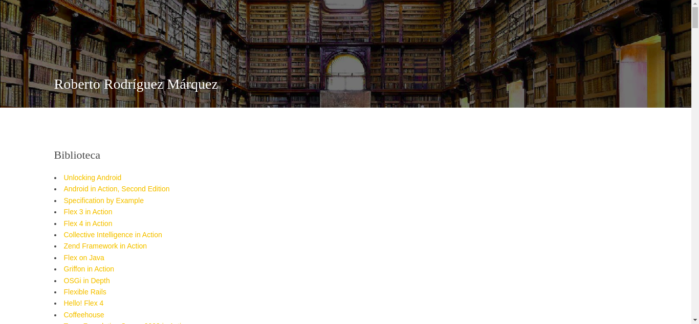
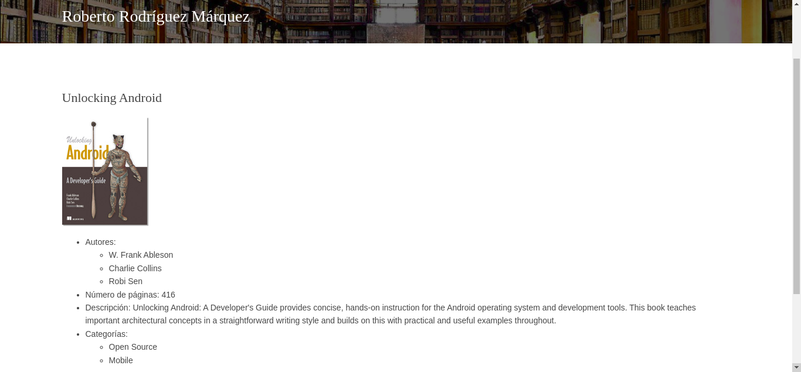
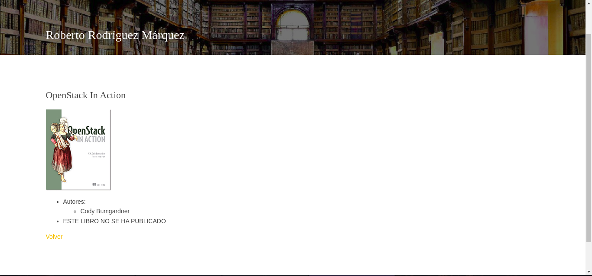

# Programa librería
Aplicación dinámica utilizando python flask  con las siguientes características:
* Utiliza la plantilla Surogou de [https://www.free-css.com/free-css-templates/page260/surogou]()
* Muestra la información del fichero [books](books.json)
* La página principal muestra una página con mi nombre, un título con la palabra "Biblioteca" y una lista de enlaces donde se ven los nombres de todos los libros y que nos llevan a una ruta del tipo /libro/\<isbn\>
* Página detalle del libro. La ruta es /libro/\<isbn\>, que muestra un título con el nombre del libro, una imagen del libro (campo thumbnailUrl) y la siguiente información del libro: Número de páginas, descripción, autores y categorías.
    * Si el ISBN no existe se devolverá un error 404.
    * Si el valor del campo status es igual a MEAP muestra un mensaje que diga "ESTE LIBRO NO SE HA PUBLICADO".

## Capturas de pantalla
* Página principal:

* Página de un libro:

* Página de un libro sin publicar:
